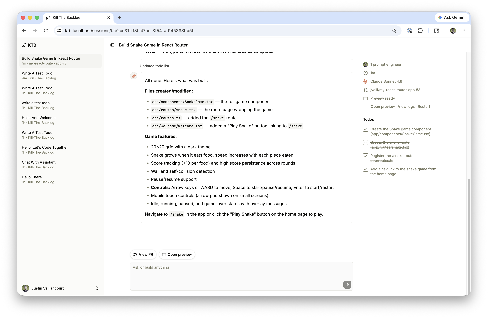

# Kill The Backlog

Self-hosted agent runner for your GitHub repos. Connect a repo, kick off coding agents in cloud sandboxes, and get PRs back — no local checkout required.



Each session spins up an E2B sandbox, clones your repo, runs [opencode](https://opencode.ai) against your prompt, then pushes commits to a fresh branch and opens a draft PR on GitHub — all streamed back to the session page in realtime.

## Quick Start

Run locally with Docker in under 5 minutes. You'll need [Docker](https://docs.docker.com/get-docker/) and [Node.js 22+](https://nodejs.org/) (to build the E2B sandbox template).

### 1. Clone and configure

```sh
git clone https://github.com/Kill-The-Backlog/Kill-The-Backlog.git
cd Kill-The-Backlog
cp .env.example .env
```

### 2. Create a GitHub OAuth App

1. Go to [**Settings → Developer settings → OAuth Apps → New OAuth App**](https://github.com/settings/applications/new)
2. Fill in:
   - **Application name:** Kill The Backlog (or anything you like)
   - **Homepage URL:** `http://localhost:3000`
   - **Authorization callback URL:** `http://localhost:3000/auth/github/callback`
3. Click **Register application**
4. Copy the **Client ID** and generate a **Client secret**
5. Paste both into your `.env`:

```
GITHUB_OAUTH_CLIENT_ID=your_client_id
GITHUB_OAUTH_CLIENT_SECRET=your_client_secret
```

### 3. Add AI provider keys

Each session boots an [E2B](https://e2b.dev/) sandbox running [opencode](https://opencode.ai/) headless, with [Anthropic](https://console.anthropic.com/) as the model provider. Add both keys to your `.env`:

```
ANTHROPIC_API_KEY=your_key
E2B_API_KEY=your_key
```

Both services have free tiers that are enough to try things out. `E2B_TEMPLATE_NAME` is already set to `e2b-template-dev` in `.env.example` — you'll publish a template under that name in the next step.

### 4. Build the E2B sandbox template

Sessions launch from a custom E2B template (opencode pre-installed). Publish it once to your E2B account:

```sh
corepack enable pnpm
pnpm install
pnpm tools:e2b-template e2b:build:dev
```

This takes a few minutes the first time. It tags the template as `e2b-template-dev` in your E2B account, matching `E2B_TEMPLATE_NAME` from the previous step.

### 5. Start

```sh
docker compose up
```

The first run builds the app image and may take a few minutes. Once you see `Server is running on http://localhost:3000`, open [**http://localhost:3000**](http://localhost:3000) and sign in with GitHub.

---

## Developing

This project uses [Devbox](https://www.jetify.com/devbox) to manage system-level dependencies (Node.js 22, PostgreSQL 18, Valkey, nginx, mkcert).

### First-time setup

```sh
devbox shell
./setup-devbox.sh
```

Create a GitHub OAuth App with callback URL `https://ktb.localhost/auth/github/callback` and add the credentials to your `.env`. A GitHub OAuth App only allows one callback URL, so if you already created one for the Quick Start (`http://localhost:3000/...`), register a second app here. Infrastructure variables (DB URL, Redis, Zero, etc.) are set automatically by `process-compose.yaml`.

If you didn't already publish the E2B sandbox template during the Quick Start, do it now:

```sh
devbox run pnpm tools:e2b-template e2b:build:dev
```

### Day-to-day development

```sh
devbox services up
```

This starts nginx (HTTPS), PostgreSQL, Valkey, the app, Zero cache, and the marketing site. Open [**https://ktb.localhost**](https://ktb.localhost).

---

## Architecture

| Component                                | Role                                                                                                                  |
| ---------------------------------------- | --------------------------------------------------------------------------------------------------------------------- |
| **Main app** (`apps/main`)               | React Router 7 + Express. Session UI, GitHub OAuth, BullMQ workers (session bootstrapper, event pump, session titler) |
| **E2B sandboxes** (`tools/e2b-template`) | Per-session VMs launched from a custom template running [opencode](https://opencode.ai) headless over HTTP + SSE      |
| **Marketing site** (`apps/www`)          | Astro static site                                                                                                     |
| **PostgreSQL**                           | Primary database (Prisma migrations, Kysely queries)                                                                  |
| **Valkey**                               | Redis-compatible store for BullMQ job queues                                                                          |
| **Zero cache**                           | [Rocicorp Zero](https://zero.rocicorp.dev) — realtime sync between DB and browser                                     |

---

## Deploying

See [docs/deploying.md](docs/deploying.md) for deploying to GKE Autopilot with werf.

---

## License

[AGPL-3.0-or-later](LICENSE)

---

## One Last Thing

Why did the developer go broke?

Because he used up all his cache trying to kill the backlog.
